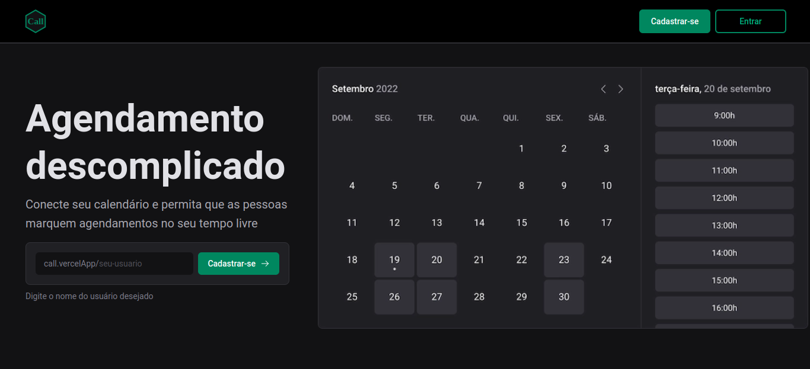

# Descomplique sua agenda 🔥
## 🔗 <a href="https://call-pi.vercel.app/">call-pi.vercel.app</a>

  <a href="#design">Design System</a> |
  <a href="#tecnologias">Tecnologias</a>

 

 

<h1 id="design">Design System 🌈</h1> 

  npm <a href="https://www.npmjs.com/package/ignite-ui">ignite-ui</a>,
  site <a href="https://rocketseat-education.github.io/05-design-system/?path=/story/home--page">design-system</a>

 

<h1 id="tecnologias">Tecnologias 🖥</h1> 
<ul>
  <li><a href="https://nextjs.org/">NextJS</a></li>
  <li><a href="https://reactjs.org/">ReactJS</a></li>
  <li><a href="https://www.typescriptlang.org/">typescript</a></li>
  <li><a href="https://next-auth.js.org/">next-auth</a></li>
  <li><a href="https://github.com/garmeeh/next-seo">next-seo</a></li>
  <li><a href="https://github.com/maticzav/nookies">nookies</a></li>
  <li><a href="https://next-auth.js.org/">next-auth</a></li>
  <li><a href="https://www.npmjs.com/package/googleapis">googleapis</a></li>
</ul>

<footer>Feito com 💚 Felipe Souza</footer>
